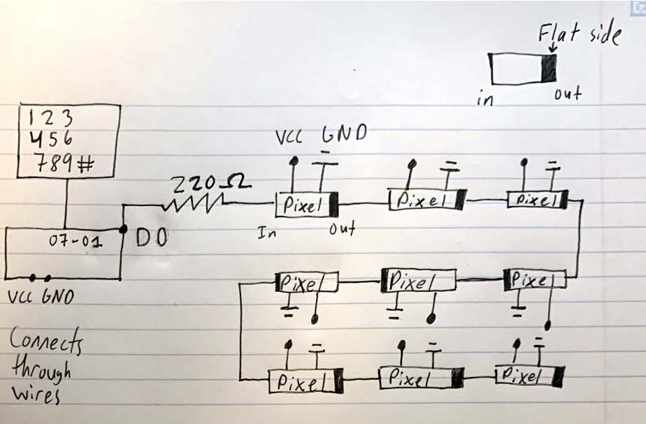

# microcontroller-tic-tac-toe

## List of Team Members:

Sharmarke Ahmed (ahme0344@umn.edu)

Christopher Dixon (dixon522@umn.edu)

Abhay Upadhyaya (upadh066@umn.edu)

Brandon Butenhoff (buten033@umn.edu)

## Project Description:

This project consists of a tic tac toe game using two Particle Photon microcontrollers that play with each other over the internet. Each microcontroller is wired onto two breadboards that contain a 3x3 matrix of neopixels as well as a keypad. The neopixels simulate a tic tac toe game, with each player having a different associated color indicating their tic or tac. Once a player wins, the winning row or column LEDs will blink three times before the game resets. If no players win the game, all neopixels will blink green once before the game resets. When one player is playing, the other player must wait for their turn and cannot play. Each player uses the keypad to indicate which LED they wish to turn on. The pound key in the keypad can be used by either player to reset the game before the game is over. 

There are three IoT cloud publishes that each photon uses, and each photon subscribes to the other photon’s three cloud publishes using particle subscription. There is a particle publish associated with requesting a game reset, updating the state variables when each player has finished their turn, and indicating that a game win has occurred.

All of the firmware used for the game is located in the firmware.ino file. Before flashing to the microcontroller, ensure that the preprocessor directives are configured to set one of the photons as PLAYER1 and the other photon as PLAYER2. Refer to the comments in the firmware.ino file for a more thorough explanation on this. Both microcontrollers must be registered under the same Particle Photon user account in order for the game to work. Additionally, both the keypad particle and neopixel libraries must be imported in order to use the firmware.

## List of Project Files:

firmware.ino

## List of Hardware Components used in the project (with part numbers)

[18 Individually Addressable LEDs (Neopixels) (WS2812)](https://docs.google.com/document/u/1/d/15UqLJ_mDqQ16eRNtT0lnVlmQ6QVm4BX43DxwAUHWk1A/edit)
[2 4x4 Matrix Membrane Keypads (zrx 543)](https://drive.google.com/file/d/0B5wD_vPJ2ttWZVdjSmtKWF9JWkU/view?resourcekey=0-prjDilQ7-XHjmriaC7XJ6w)

## Circuit Diagram:

